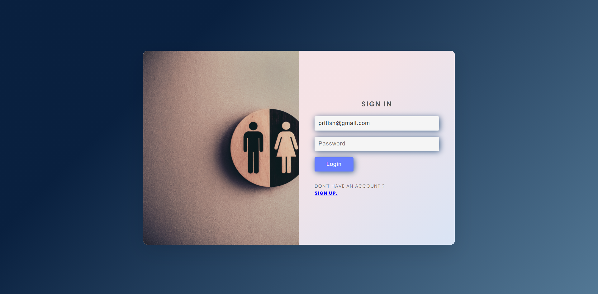

# **INCLUSIVITY**
Project made during Hackviolet Hackathon

## ABOUT
Inclusivity is a webapp built on **React.js**, **Material UI** and Firebase tools such as **Cloud Firestore** and **Firebase Auth**. In this, a user can signup or login and can view all types of **Internships**, **Fellowships**, **Internships** and **Placement** Opportunities. We managed to collect the data with the help of a **Web scrapper** using **Selenium** and **LinkedIn API**. The webapp has all kind of opportunities ranging from **open to all categories of genders** to opportunities **specific only to Women and LGBTQIA Community**.

### **SCREENSHOTS OF THE WEB APP**

